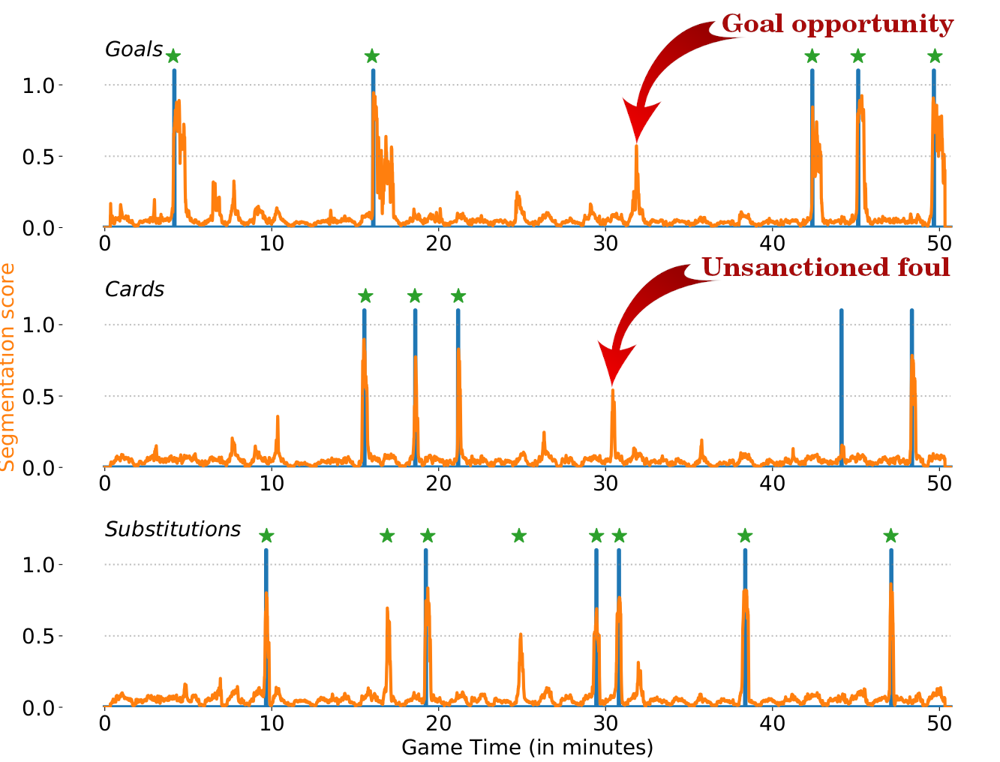
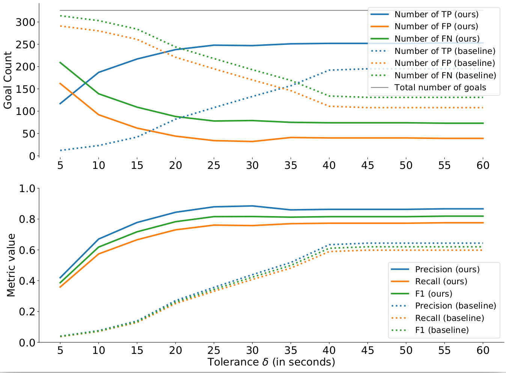

# A Context-Aware Loss Function for Action Spotting in Soccer Videos

This repository contains the code to reproduce the main results of the paper: "A Context-Aware Loss Function for Action Spotting in Soccer Videos". The paper can be found here: [Paper](https://arxiv.org/abs/1912.01326). This paper will be presented at the main conference on Computer Vision and Pattern Recognition (CVPR) in June 2020.

```bibtex
@InProceedings{Cioppa2020Context,
  author = {Cioppa, Anthony and Deliège, Adrien and Giancola, Silvio and Ghanem, Bernard and Van Droogenbroeck, Marc and Gade, Rikke and Moeslund, Thomas B.},
  title = {A Context-Aware Loss Function for Action Spotting in Soccer Videos},
  booktitle = {The IEEE Conference on Computer Vision and Pattern Recognition (CVPR)},
  month = {June},
  year = {2020}
}
```

The objective of this work is to spot three types of actions in soccer videos: goals, cards and substitutions, as described in the [SoccerNet](https://arxiv.org/pdf/1804.04527.pdf) dataset. To do so, we present a novel loss that leverages the temporal context around an action spot. The main idea behind this loss is to penalize the frames far-distant from the action and steadily decrease the penalty for the frames gradually closer to the action. The frames just before the action are not penalized to avoid providing misleading information as its occurrence is uncertain. However, those just after the action are heavily penalized as we know for sure that the action has occurred.

<p align="center"></p>

This repository provides every module needed to reproduce the results of the paper on the SoccerNet data: the network architecture, the losses, the training procedure and the evaluation. In particular, it provides a notebook to reproduce Figure 6 of the paper for the three classes (goal, card, substitution) and Figure 7 for different games.


## Getting Started

The following instructions will help you install the required libraries and the dataset to run the code. The code runs in <code>python 3</code> and was tested inside a nvidia-docker with the folowing base image: <code>tensorflow:18.02-py3</code> which can be found at the following address: [NVIDIA TENSORFLOW IMAGE REPOSITORY](https://ngc.nvidia.com/catalog/containers/nvidia:tensorflow/tags) and a conda environment.


### Prerequisites

Whether you are using the docker image or not, here are the versions of the libraries that are used:

```
numpy==1.17.2
tabulate==0.8.5
tqdm==4.23.1
h5py==2.10.0
matplotlib==3.0.3
opencv-python-headless==4.1.2.30
opencv-contrib-python-headless==4.1.2.30
tensorflow==2.0.0
```

### Installing the libraries on docker

If you are using the nvidia-docker, you can follow these steps to instantiate the docker and install the libraries:


In our case we used the following commands to create the dockers. Note that you will need to replace */path/to/your/directory/* by the path to one of your directories and *path/to/the/docker/image* by the path to the docker image. Note that you can select the GPUs to use by changing the index(es) of the *NV_GPU* variable.

```
NV\_GPU=0 nvidia-docker run --name Context\_Aware\_Benchmark -it --rm --shm-size=1g --ulimit memlock=-1 -v /path/to/your/directory/:/workspace/generic path/to/the/docker/image
```

To install the code and libraries, simply run:

```
1. git clone https://github.com/cioppaanthony/context-aware-loss
3. cd context-aware-loss
3. bash docker\_install.sh
```

At this step, all the required libraries are installed. Note that outside of a docker, sudo permission can be required to install the libraries in the <code>docker_install.sh</code> file.


### Installing the libraries with conda

If you are using conda, simply follow these steps to create the environment and install the required libraries:

```
conda create -n context_aware
conda install python=3.7 pip cudnn cudatoolkit=10.1
pip install numpy==1.17.3 tabulate==0.8.5 tqdm==4.23.1 h5py==2.10.0 matplotlib==3.0.3 opencv-python-headless==4.1.2.30 opencv-contrib-python-headless==4.1.2.30 tensorflow==2.1.0 scikit-video
```

### Installing the SoccerNet Dataset

We provide two ways of loading the dataset: from the original SoccerNet dataset or from a compact preprocessed version of the ResNET_PCA512 features and the labels for this particular code.

**Option 1:** If you wish to install the entire SoccerNet dataset, please follow the instructions on the author's github: [SoccerNet GitHub](https://github.com/SilvioGiancola/SoccerNet-code). In the following command lines, the <code>-d path/to/soccernet/data/</code> will then need to be the <code>data</code> folder of that SoccerNet dataset. Note that you will also need to download the files that indicate which games belong to the train, validation or test set. Simply replace the path in the following command lines by the path to the soccernet data you downloaded.

```
wget -P path/to/soccernet/data/  https://raw.githubusercontent.com/SilvioGiancola/SoccerNet-code/master/data/listgame_Train_300.npy
wget -P path/to/soccernet/data/  https://raw.githubusercontent.com/SilvioGiancola/SoccerNet-code/master/data/listgame_Valid_100.npy
wget -P path/to/soccernet/data/  https://raw.githubusercontent.com/SilvioGiancola/SoccerNet-code/master/data/listgame_Test_100.npy
```

**Option 2:** If you only need the ResNET\_PCA512 features, we provide them alongside the labels already concatenated and ready to use in this code at the following address: [ResNET_PCA512.zip](https://drive.google.com/drive/folders/1VuVuwkJG1lTRNbwEno6fzcOe6zeBP45y?usp=sharing). Unzip them and use the folder containing the ".npy" files for <code>-d path/to/soccernet/data/</code> in the following command lines. Note that the labels are already time-shift encoded here. You can also use <code>gdown</code> to directly download the zip, then unzip it.

```
pip install -U pip setuptools
pip install gdown
gdown https://drive.google.com/uc?id=1GeohUJww3U_F4oacsc3nRU_PJbf-Xqp-
unzip ResNET_PCA512.zip
```


## Training the network

The code for training the network is located inside the <code>src</code> folder under the name <code>train.py</code>. The architecture of the network is in the <code>model.py</code> under the name *baseline*.

<p align="center"></p>

Before running the code, create a folder to save the trained network weights and the evaluation metrics on the validation set. Then, simply go to the <code>src</code> folder and run the following command:

```
python3 train.py -d path/to/soccernet/data/ -s path/to/save/trained/weights/
```

This code will save:
1. The weights of the network having the best average-mAP on the validation set in the file <code>best_average_mAP.h5</code>.
2. The weights of the network at the last epoch in the file <code>last_weights.h5</code>.
3. A log file with the average-mAP at each 20 epochs on the validation set, separated by commas in the file <code>Validation_Average_mAP.log</code>.

This code will train the network on the ResNET_PCA512 features by default for 1000 epochs and evaluate the performance on the validation set every 20 epochs. If you want to modify the total number of epochs, use the <code>-e</code> argument (eg. <code>-e 500</code>). To modify the frequency of the evaluation on the validation set, use the <code>-ev</code> argument (eg. <code>-ev 40</code>). To change the type of feature, use the <code>-t</code> argument (eg. <code>-t C3D_PCA512.npy</code>, <code>-t I3D_PCA512.npy</code>, <code>-t ResNET.npy</code>,...).

Note that a lot of different arguments are also available for this command line in the <code>utils/argument\_parser.py</code> file to control the training.

## Inference on the test set

The code for testing the network on the test set is located inside the <code>src</code> folder under the name <code>test.py</code>.

Again, before running this code, create a folder for saving the results. Once you created the folder, simply run the following command:

```
python3 test.py -d path/to/soccernet/data/ -s path/to/save/results/ -w path/to/trained/weights/weights_file.h5
```

Note that if you do not want to train the network, we provide some weights that we obtained ourselves as described in the paper in the <code>weights</code> folder, under the name <code>soccernet_trained_weights_resnet_pca512.h5</code>. If you trained the network, simply point the <code>-w</code> to a <code>weights.h5</code> file of your choice (e.g. <code>best_average_mAP.h5</code> file created during the training)".

This code will save multiple results:
1. A log file with the average-mAP in the file <code>Test_Average_mAP.log</code>.
2. A set of numpy arrays for each half time of each game in the test set. These arrays will be used to create Figure 7 in the jupyter notebook. The segmentation scores are saved in the <code>Test\_"GAME\_INDEX"\_segmentations.npy</code>, the targets in the <code>Test\_"GAME\_INDEX"\_labels.npy</code>, the detected action spots with the confidence score in the <code>Test\_"GAME\_INDEX"\_detections\_scores.npy</code> and the detected action spots in the <code>Test\_"GAME\_INDEX"\_detections.npy</code> file.

Once all these results are saved for the entire test set, you can move on to the jupyter notebook in the <code>notebooks</code> folder and run it.
```
1. cd ../notebooks/
2. jupyter notebook

3. *Replace the path in the first block by the folder where you saved your test results: /path/to/save/results/*
4. *Run the whole notebook.*
```

If you used our pre-trained weights for the test, you should get the following graphs:

<p align="center"></p>
<p align="center"></p>

## Authors

* **Anthony Cioppa**, University of Liège (ULiège).
* **Adrien Deliège**, University of Liège (ULiège).
* **Silvio Giancola**, King Abdullah University of Science and Technology (KAUST).

See the [AUTHORS](AUTHORS) file for details.


## License

Apache v2.0
See the [LICENSE](LICENSE) file for details.

## Acknowledgments

* Anthony Cioppa is funded by the FRIA, Belgium.
* This work is supported by the DeepSport project of the Walloon Region, at the University of Liège (ULiège), Belgium.
* This work is also supported by the King Abdullah University of Science and Technology (KAUST) Office of Sponsored Research (OSR).
